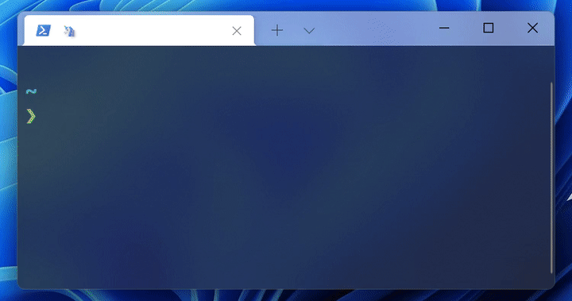

# cisco-vpn-rdp-connecter
> Connect to Cisco AnyConnect VPN and open a Microsoft Remote Desktop (RDP) window



See [FAQ](#faq) for more details and background.

## CLI
### Install
```sh
npm install --global cisco-vpn-rdp-connecter
```

### Usage
```
$ cisco-vpn-rdp-connecter --help
    Usage
      $ cisco-vpn-rdp-connecter

    Options
      --disconnect, -d  Disconnect from both VPN and RDP
      --setup, -s       Setup the credentials for Cisco VPN and Microsoft RDP
      --status          Show connection statuses for VPN and RDP
```

## API
### Install
```sh
npm install cisco-vpn-rdp-connecter
```

### Usage
```js
const {connectToVpnAndOpenRdp} = require('cisco-vpn-rdp-connecter');

const vpnCredentials = {
    server: 'server.name',
    group: '1',
    username: 'knut',
    password: 'super_secure_password'
};
const rdpServer = 'rdp.server.name';

(async () => {
    await connectToVpnAndOpenRdp(vpnCredentials, rdpServer);
})();
```

### Exports
#### connectToVpn(server, group, username, password)
#### openRdpWindow(server)
#### connectToVpnAndOpenRdp(vpnCredentials, rdpServer)
#### isCiscoVpnConnected()
#### isRdpWindowOpened()
#### getAllCiscoVpnGroups(server)
#### getCiscoVpnDefaults()
#### getRdpDefaults()
#### disconnectFromVpn()
#### closeRdpWindow()

## FAQ
### Why this CLI?
Instead of:
1. open Cisco AnyConnect
2. type in credentials and connect
3. open Microsoft Remote Desktop
4. select server and connect

Just open a terminal and type `cisco-vpn-rdp-connecter` to do all that without the hassle.

I personally use this to efficiently connect to a remote work computer.
